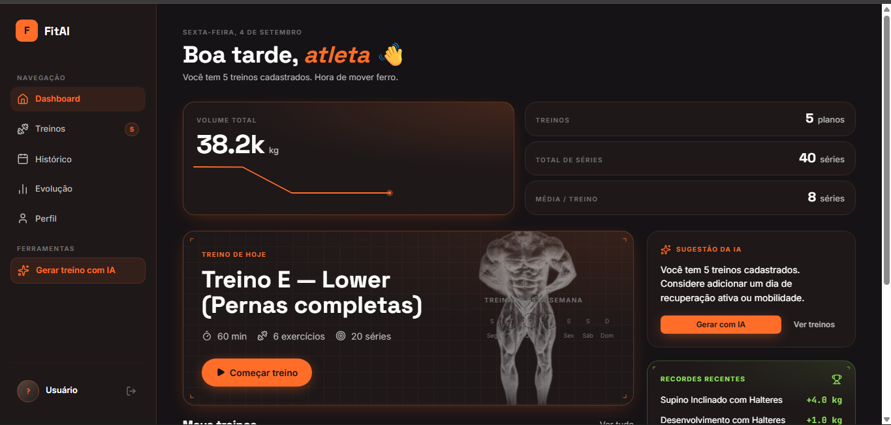
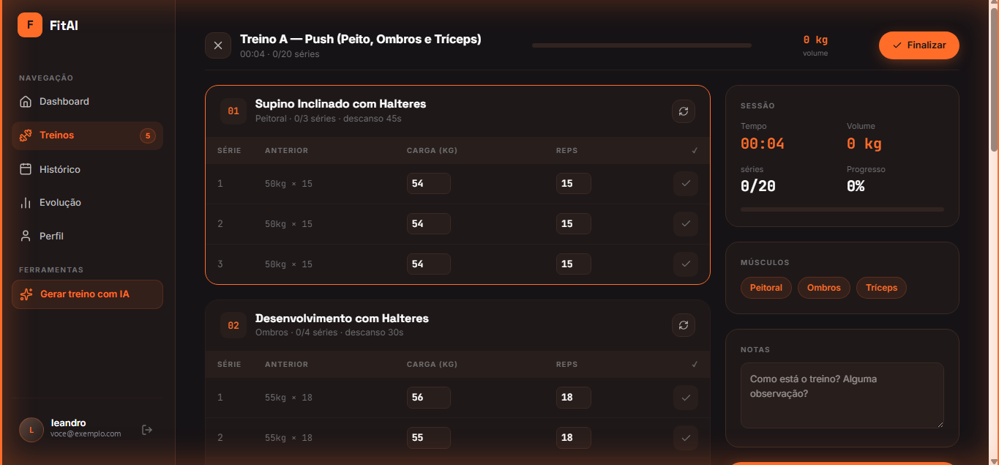
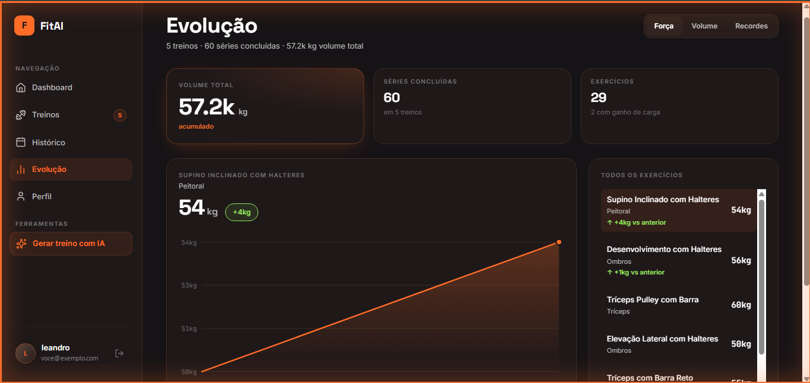

# FitAI 🏋️‍♂️🧠


> Plataforma inteligente de treinos personalizados — monorepo com frontend Next.js, backend Spring Boot e um worker Node.js para geração de treino por IA.

O **FitAI** é uma aplicação web completa para gestão e acompanhamento de treinos físicos. Crie planos por divisão muscular (Push/Pull/Legs, Upper/Lower, ABC), execute sessões com acompanhamento em tempo real, registe a sua evolução física (medidas, peso, fotos) e analise a progressão de carga e volume. Precisa de inspiração? A integração com IA gera rotinas personalizadas com base no seu perfil, objetivos e equipamento disponível — de forma assíncrona, através de uma fila Kafka.

🔗 **Notas de Arquitetura:** Para decisões de design, trade-offs aceitos e dívida técnica conhecida, consulte o [ARCHITECTURE.md](ARCHITECTURE.md).

---

## 📑 Índice

1. [Preview](#-preview)
2. [Stack Tecnológica](#-stack-tecnológica)
3. [Funcionalidades Principais](#-funcionalidades-principais)
4. [Estrutura do Monorepo](#-estrutura-do-monorepo)
5. [Configuração e Arranque Local](#-configuração-e-arranque-local)
6. [Testes](#-testes)
7. [Documentação da API](#-documentação-da-api)
8. [Fluxo de Dados](#-fluxo-de-dados)
9. [Deploy](#-deploy)
10. [Variáveis de Ambiente](#-variáveis-de-ambiente)

---

## 📸 Preview

| Landing page | Login |
|---|---|
|  |  |

| Dashboard | Execução de treino ao vivo |
|---|---|
|  |  |

| Evolução de carga |
|---|
|  |

---

## 🛠 Stack Tecnológica

| Camada | Tecnologia |
|---|---|
| **Frontend** | Next.js 16 · React 19 · TypeScript · Tailwind CSS 4 |
| **Backend** | Spring Boot 4 · Java 21 · Spring Security · JWT |
| **Worker (IA)** | Node.js 20 · KafkaJS · Express (health check) |
| **Base de Dados** | PostgreSQL 17/18 · Flyway (Migrations) |
| **Mensageria** | Kafka — Redpanda local (Docker) / broker gerido em produção |
| **Autenticação** | JWT (Access + Refresh) · Google OAuth2 |
| **Inteligência Artificial** | Groq API (GPT-OSS 120B, via Groq Cloud) — chamada só pelo worker |
| **Armazenamento de ficheiros** | Vercel Blob (fotos de evolução física, privadas) |
| **Testes** | Vitest + Testing Library (Front) · JUnit 5 (Back) · Playwright (E2E) |
| **Deploy** | Vercel (Frontend) · Railway (Backend · Worker · PostgreSQL · Redpanda) |

---

## ✨ Funcionalidades Principais

* **Autenticação Robusta:** Registo/login tradicional ou Google OAuth2, com sistema de *refresh tokens* e recuperação de password. Proteção contra abusos via *Rate Limiting*.
* **Gestão de Treinos:** Criação de *splits* musculares flexíveis (PPL, Upper/Lower, Full Body). Suporte a duplicação de blocos para treinos alternados (ex: Upper 1 / Upper 2).
* **Catálogo Integrado:** 57 exercícios pré-definidos divididos por 9 grupos musculares. Pesquisa rápida por nome ou agrupamento.
* **Modo Sessão ao Vivo:** Execução guiada com *timer* de descanso automático, cronómetro geral, e edição fluída de pesos e repetições série a série.
* **Histórico e Progressão:** Gravação inteligente de cargas. A sessão atual exibe o peso da sessão anterior para facilitar a progressão de carga (Overload).
* **Dashboard Analítico:** Gráficos de evolução de carga, volume acumulado e recordes pessoais alimentados por dados reais das sessões concluídas.
* **Evolução Física:** Registo de medidas corporais, metas de peso e fotos de progresso (guardadas em blob privado — nunca acessíveis por URL direta).
* **Geração por IA (assíncrona):** O frontend enfileira o pedido no backend (`POST /workout-generation-jobs`) e faz *polling* do estado. Um worker Node.js dedicado consome a fila Kafka, chama a Groq e devolve o plano — analisando nível de experiência, frequência semanal e material disponível.

---

## 📂 Estrutura do Monorepo

```text
FitAI/
├── docker-compose.yml              # Infra local: Postgres + Redpanda (+ backend/worker opcionais)
│
├── frontend/                       # Next.js 16 App Router
│   ├── app/
│   │   ├── (auth)/                 # Login, registo, recuperação
│   │   ├── (dashboard)/            # Rotas protegidas (treinos, progresso, físico, ai-gen)
│   │   └── api/body-photos/        # Rota que faz upload da foto pro Vercel Blob e guarda só a URL
│   ├── components/                 # UI components, Modais e Gráficos
│   ├── hooks/                      # Lógica de estado (Workouts, Sessions, Progress)
│   ├── lib/                        # Cliente API, auth JWT e Dicionário de Exercícios
│   └── proxy.ts                    # Middleware de proteção de rotas (Next.js 16)
│
├── backend/                        # Spring Boot 4
│   ├── Dockerfile                  # Multi-stage build para produção
│   ├── DEPLOY.md                   # Guia de deploy
│   └── src/main/
│       ├── java/com/fitai/fitai_backend/
│       │   ├── controller/         # Endpoints REST
│       │   ├── service/            # Regras de negócio e integração Google Auth
│       │   ├── event/ & listener/  # Produção/consumo dos eventos Kafka (geração de treino, auditoria)
│       │   ├── model/ & dto/       # Entidades JPA e Records/Classes DTO
│       │   └── security/           # Filtros JWT e Configurações CORS/BCrypt
│       └── resources/
│           └── db/migration/       # Scripts SQL (Flyway)
│
└── worker/                         # Worker Node.js (geração de treino por IA)
    ├── Dockerfile
    └── src/
        ├── consumer.js             # Consome fitai.workout-generation-requested
        ├── groqClient.js           # Monta o prompt e chama a Groq
        ├── producer.js             # Publica o resultado em fitai.workout-generation-result
        └── promptBuilder.js        # Constrói o prompt e expande os treinos gerados
```

---

## 🚀 Configuração e Arranque Local

### Pré-requisitos
* Node.js 20+
* Java 21+
* Docker (para o PostgreSQL e o Redpanda via `docker-compose`)

### 1. Infraestrutura (Postgres + Redpanda)
Na raiz do repositório:
```bash
docker compose up postgres redpanda
```
Sobe o PostgreSQL e o Redpanda (broker Kafka). O schema é criado automaticamente pelo Flyway no arranque do backend. As portas expostas estão no [docker-compose.yml](docker-compose.yml); ajuste `DB_URL` se o Postgres não ficar em `localhost:5432`.

### 2. Backend
```bash
cd backend
./gradlew bootRun --args='--spring.profiles.active=local'
```
*A API ficará disponível em `http://localhost:8081`.* O perfil `local` usa Kafka em plaintext (sem SASL) contra o Redpanda acima.

### 3. Worker (geração por IA)
```bash
cd worker
npm install
cp .env.example .env      # preencha GROQ_API_KEY; os defaults de Kafka já apontam pro Redpanda local
npm start
```
*Sem o worker a correr, os pedidos de geração ficam na fila e o frontend acaba por mostrar timeout.*

### 4. Frontend
Crie o ficheiro `frontend/.env.local` baseado nas variáveis de ambiente listadas [abaixo](#-variáveis-de-ambiente) e execute:
```bash
cd frontend
npm install
npm run dev
```
*A App ficará disponível em `http://localhost:3000`.*

> 💡 Alternativa: `docker compose up --build` sobe o pipeline inteiro (Postgres, Redpanda, backend e worker) containerizado. O frontend fica sempre de fora, para manter o hot reload.

---

## 🧪 Testes

**Frontend:**
```bash
cd frontend
npm test                  # Execução única (Vitest)
npm run test:watch        # Modo Watch
npm run test:coverage     # Relatório de cobertura
```

**Backend:**
```bash
cd backend
./gradlew test            # Testes unitários e de integração (com H2 e MockMvc)
```

**E2E (Playwright):**
Garante o funcionamento de ponta a ponta (Front + Back + DB reais).
```bash
# Certifique-se de que o Frontend e Backend estão a correr em outros terminais
cd frontend
npx playwright install chromium   # Apenas na primeira execução
npm run test:e2e
```

---

## 📡 Documentação da API

Todas as rotas (exceto `/auth/*`) exigem `Authorization: Bearer <access token>`.

### Autenticação (`/auth`)
| Método | Rota | Descrição |
|:---:|---|---|
| `POST` | `/register` | Registo com email/password |
| `POST` | `/login` | Login com email/password |
| `POST` | `/google` | Login via Google OAuth2 |
| `POST` | `/refresh` | Rotação de *Refresh Token* |
| `POST` | `/forgot-password`| Pedido de recuperação de conta |
| `POST` | `/reset-password` | Redefinição de senha via token |

### Treinos (`/workouts`)
| Método | Rota | Descrição |
|:---:|---|---|
| `GET` | `/` | Lista todos os treinos do utilizador |
| `POST` | `/` | Cria um novo treino |
| `GET` | `/progress` | Estatísticas de evolução de carga/volume |
| `GET` | `/sessions/recent` | Últimas sessões concluídas |
| `GET` | `/{id}` | Detalhes de um treino específico |
| `PUT` | `/{id}` | Atualiza estrutura de um treino |
| `DELETE`| `/{id}` | Elimina um treino |
| `POST` | `/{id}/session` | Submete dados de uma sessão concluída |

### Geração por IA (`/workout-generation-jobs`)
| Método | Rota | Descrição |
|:---:|---|---|
| `POST` | `/` | Enfileira um pedido de geração (responde `202` com o `id` do job) |
| `GET` | `/{id}` | Consulta o estado do job (`PENDING` / `DONE` / `FAILED`) — usado no *polling* |

### Evolução Física
| Método | Rota | Descrição |
|:---:|---|---|
| `GET` / `POST` | `/body-measurements` | Lista / regista medidas corporais |
| `DELETE` | `/body-measurements/{id}` | Elimina uma medida |
| `GET` / `POST` | `/body-weight-goals` | Lista / define metas de peso |
| `DELETE` | `/body-weight-goals/{id}` | Elimina uma meta |
| `GET` / `POST` | `/body-photos` | Lista / regista foto de progresso (metadados; o binário vai para o Vercel Blob via rota Next.js) |
| `DELETE` | `/body-photos/{id}` | Elimina uma foto |

---

## 🔄 Fluxo de Dados

### Sessão de Treino

O armazenamento de dados de treino resolve a dicotomia entre "estado atual da carga" e "histórico estatístico".

1. **Frontend (Sessão):** O utilizador executa o treino. O peso e as repetições são ajustados.
2. **Submissão:** O *payload* é enviado para `POST /workouts/{id}/session`.
3. **Backend (`WorkoutService.saveSession`):**
   * Atualiza a tabela `SetData`: O `weight` anterior move-se para `prev`. O novo `weight` é guardado. Isso garante que a próxima sessão mostre a carga exata a ser batida.
   * Insere na tabela `WorkoutSession`: Grava uma nova linha imutável com `totalVolume`, `setsCompleted` e data, servindo como base absoluta para todos os gráficos do dashboard.
4. **Visualização (`GET /workouts/progress`):** Cruza a evolução estática (SetData) com a métrica temporal (WorkoutSessions).

### Geração de Treino por IA (assíncrona)

A chamada à IA foi tirada do frontend de propósito: pode demorar 20–30 s (acima do teto de função *serverless*) e a chave da Groq nunca deve chegar ao browser.

```
frontend ──POST /workout-generation-jobs──▶ backend  (grava job PENDING, publica evento)
                                               │
                                               ▼
                          Kafka: fitai.workout-generation-requested
                                               │
                                               ▼
                                     worker (Node.js)  ── monta prompt, chama a Groq ──▶ Groq API
                                               │
                                               ▼
                          Kafka: fitai.workout-generation-result
                                               │
                                               ▼
                             backend (WorkoutGenerationResultListener) ── atualiza job → DONE / FAILED
                                               │
                                               ▼
                    frontend faz polling em GET /workout-generation-jobs/{id}
```

O backend também publica eventos de auditoria (login, treino criado, sessão registada) num tópico Kafka próprio — sem consumidor por enquanto; a falha de publicação é apenas registada, nenhum fluxo principal depende disso.

---

## ☁️ Deploy

Toda a infra de produção (exceto o frontend) corre no **Railway**, num único projeto: os serviços `fitai` (backend), `worker`, `PostgreSQL` e `broker` (Redpanda).

### Backend + Worker + Infra (Railway)
1. Crie um projeto no Railway e adicione os *plugins* **PostgreSQL** e **Redpanda/Kafka**.
2. Crie um serviço a partir deste repositório com root `backend` (runtime Docker) e outro com root `worker`.
3. Ligue as variáveis de ambiente de cada serviço (ver [abaixo](#-variáveis-de-ambiente)). O backend e o worker apontam para o mesmo broker Kafka através das variáveis internas do Railway.
4. `GROQ_API_KEY` vive **apenas no serviço `worker`**.

> 📖 **Guia Passo-a-Passo:** Consulte [backend/DEPLOY.md](backend/DEPLOY.md).

### Frontend (Vercel)
1. Importe o repositório na Vercel e defina o **Root Directory** como `frontend`.
2. Crie um **Blob Store** (aba *Storage*) e ligue-o ao projeto — isso injeta o `BLOB_READ_WRITE_TOKEN`.
3. Configure as restantes variáveis de ambiente (apontando `NEXT_PUBLIC_API_URL` para o backend no Railway).
4. Adicione o domínio de produção da Vercel às **Origens JavaScript autorizadas** no Google Cloud Console.
5. Deploys contínuos são feitos automaticamente em pushes para a *branch* `main`.

---

## ⚙️ Variáveis de Ambiente

### Backend (`application-local.properties` / Railway)
| Variável | Descrição / Exemplo |
|---|---|
| `DB_URL` | URL JDBC do Postgres (`jdbc:postgresql://...`) |
| `DB_USERNAME` / `DB_PASSWORD` | Credenciais da base de dados |
| `JWT_SECRET` | Chave de assinatura criptográfica (Mín. 256 bits) |
| `JWT_EXPIRATION` | TTL do access token em ms (Default: `86400000` / 24h) |
| `JWT_REFRESH_EXPIRATION`| TTL do refresh token em ms (Default: `604800000` / 7d) |
| `GOOGLE_CLIENT_ID` | Client ID gerado no Google Cloud Console |
| `CORS_ALLOWED_ORIGINS` | URLs do frontend separadas por vírgula |
| `SENDGRID_API_KEY` | Chave da API SendGrid (usada via HTTPS para contornar bloqueios SMTP) |
| `SENDGRID_FROM` | Email remetente autorizado no painel SendGrid |
| `FRONTEND_URL` | URL base do client (usado em links de e-mail) |
| `KAFKA_BOOTSTRAP_SERVERS` | Broker Kafka (SASL_SSL em produção; vazio desativa a publicação) |
| `KAFKA_SASL_JAAS_CONFIG` | Credenciais SASL/PLAIN do broker gerido |
| `KAFKA_WORKOUT_GEN_REQUESTED_TOPIC` | Default: `fitai.workout-generation-requested` |
| `KAFKA_WORKOUT_GEN_RESULT_TOPIC` | Default: `fitai.workout-generation-result` |
| `FLYWAY_OUT_OF_ORDER` | Aceita migrations fora de sequência (Default: `true`) |

### Worker (`.env` / Railway)
| Variável | Descrição |
|---|---|
| `GROQ_API_KEY` | Chave da Groq Cloud — **só existe aqui** (formato `gsk_...`, sem aspas) |
| `KAFKA_BOOTSTRAP_SERVERS` | Broker Kafka (Redpanda local: `localhost:9092`) |
| `KAFKA_SASL_USERNAME` / `KAFKA_SASL_PASSWORD` | Credenciais SASL do broker gerido (vazias = plaintext local) |
| `WORKOUT_GEN_REQUESTED_TOPIC` | Tópico consumido (Default: `fitai.workout-generation-requested`) |
| `WORKOUT_GEN_RESULT_TOPIC` | Tópico produzido (Default: `fitai.workout-generation-result`) |
| `KAFKA_CONSUMER_GROUP` | Consumer group do worker (use um valor por ambiente) |
| `PORT` | Porta do health check HTTP (Default: `8080`) |

### Frontend (`.env.local` / Vercel)
| Variável | Descrição |
|---|---|
| `NEXT_PUBLIC_API_URL` | Endereço público do Backend |
| `NEXT_PUBLIC_GOOGLE_CLIENT_ID`| Mesmo Client ID usado no Backend |
| `JWT_SECRET` | Partilhada com o backend — valida o JWT do utilizador nas rotas `/api/body-photos` antes do upload |
| `BLOB_READ_WRITE_TOKEN` | Token do Vercel Blob Store — só no servidor, nunca exposto ao browser |

---

## 📄 Licença

Distribuído sob a licença MIT.
